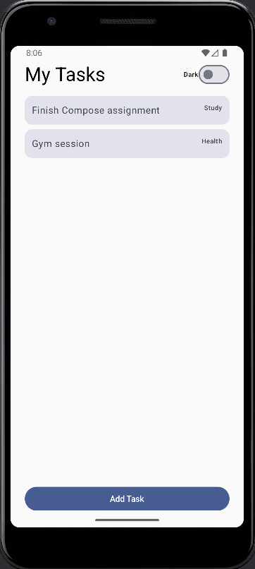
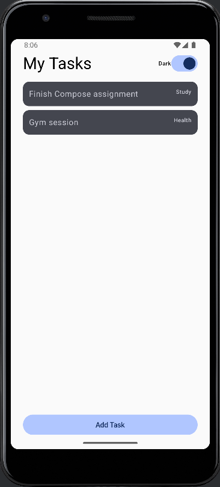

A multi-screen Android app built with Jetpack Compose, demonstrating all core Android development concepts.




Features

- ✅ View tasks in a scrollable list
- ✅ Add new tasks with a title and category
- ✅ Tap a task to mark it as done (animated color change)
- ✅ Dark mode toggle that persists across app restarts
- ✅ Quote of the day fetched from a live API
- ✅ Notification when a new task is added

Tech Stack

| Topic | Implementation |
|---|---|
| Language | Kotlin |
| UI Framework | Jetpack Compose |
| Architecture | MVVM (ViewModel + StateFlow) |
| Navigation | Navigation Compose |
| Networking | Retrofit + Gson |
| Local Persistence | DataStore Preferences |
| Animations | animateColorAsState |
| Lists | LazyColumn |
| Notifications | NotificationCompat + Runtime Permission |

Project Structure

```
app/src/main/java/com/example/taskmanager/
├── data/
│    ├── Task.kt                  # Data class + TaskCategory enum
│    ├── TaskRepository.kt        # In-memory data source with coroutines
│    └── SettingsRepository.kt    # DataStore for dark mode preference
├── network/
│    └── QuoteApiService.kt       # Retrofit interface for quote API
├── notifications/
│    └── TaskNotifier.kt          # Notification channel + permission handling
├── viewmodel/
│    ├── TaskViewModel.kt         # MVVM: tasks state + business logic
│    └── SettingsViewModel.kt     # MVVM: dark mode state
├── ui/
│    ├── Screen.kt                # Navigation route definitions
│    ├── AppNavGraph.kt           # NavHost wiring all screens
│    ├── screens/
│    │    ├── HomeScreen.kt       # Task list + quote card + dark mode toggle
│    │    └── AddTaskScreen.kt    # Form to add a new task
│    ├── components/
│    │    └── TaskItem.kt         # Reusable task card composable
│    └── theme/                   # Colors, typography, theme
└── MainActivity.kt               # Entry point, permission request

```

## Built By

  **Adnan Baig**
